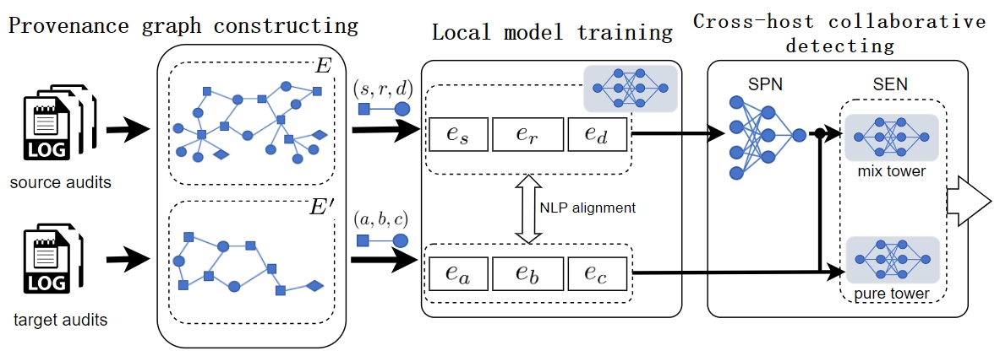

# CTPGD

This is official code for the ICICN 2025 paper:

**Collaborative transfer framework for provenance graph-based detection**

In this paper, we propose a CTPGD framework to select samples from the source graph that are beneficial to the target graph training. 

## Note

Our code will be released soon.

## Cite 
 
If you make advantage of CTPGD in your research, please cite the following in your manuscript:

> Will be released soon.
